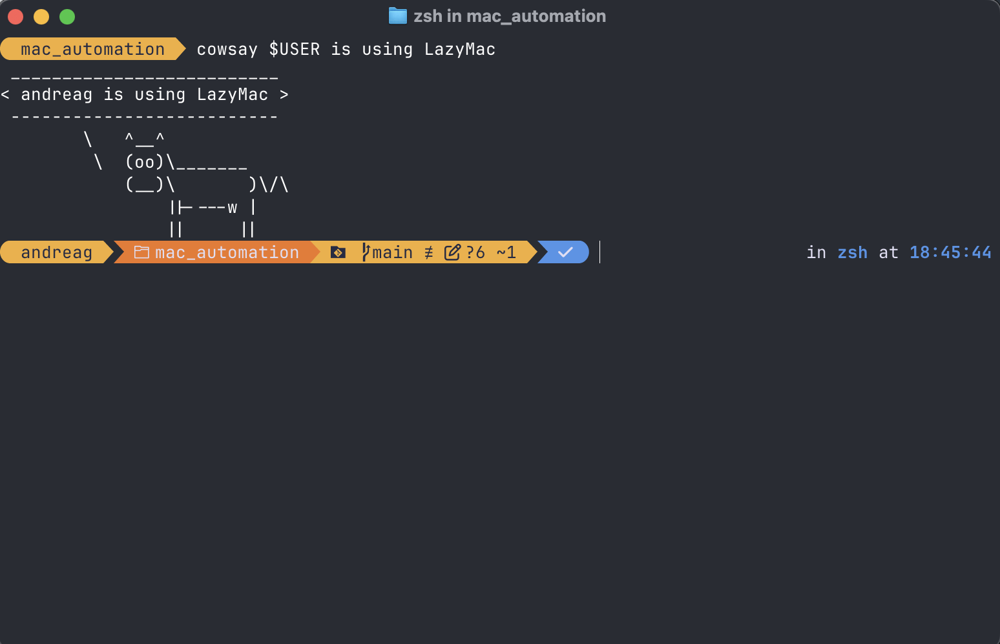

# Lazy Mac

## Getting started

This project is meant to transform your brand new macbook in a full fledged developer workstation with the useful tools and sensible default so you don't need to do a tedious setup on your own.

At the end of the execution you will find in your macbook the following tools ready for use:


- Xcode command line tools
- Homebrew
- Ghostty
- Oh-my-posh
- Visual Studio Code
- Git
- Tmux
- Podman and Podman-Desktop
- Intellij CE
- Chruby
- JEnv
- JFrog-Cli
- Kubectx
- K9s
- Helm
- TFswitch
- TGSwitch
- Opentofu
- Tflint
- Checkov 
- Terragrunt
- Packer




## How to use it

Just run this oneliner. 

```
curl -L https://github.com/threeturn/MacOs-Bootstrap/archive/refs/heads/main.zip -o main.zip && unzip main.zip && cd MacOs-Bootstrap-main && ./bootstrap.sh
```

## But i'm using X and I don't see it!

A lot of features are missing, and will be added in the future. Feel free contibute. 

## You are using Chef, I want to use X

Cool, do it! I like Chef, it's simple and flexible for this type of use cases.

## X is not working as expected. 

Please create an issue in github. I will do my best to fix it.

## Where are the inspec tests.

ENOTIME, and I'm a bit lazy, but I will add it eventually. Bare with me. 


